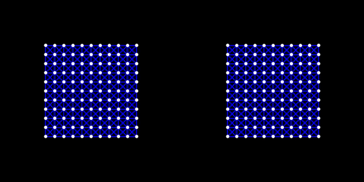

# 太极图形课S1-大作业

## 作业来源
> 复现论文Predictive-Corrective Incompressible SPH (TOG 2009)

## 运行方式

#### 运行环境：
> [Taichi] version 0.8.3, llvm 10.0.0, commit 021af5d2, win, python 3.9.7

#### 运行：
> python PCISPH.py

## 效果展示
> 

## 整体结构
> 
```
-LICENSE
-|data
	-|pcisph.gif
-README.MD
-PCISPH.py
```

## 实现细节：
> 请给出代码的具体实现流程和细节，让感兴趣的人能够更深入的了解你的代码。

# 示例
下面给出一个模版供大家参考，在你提交大作业的时候可以删除示例部分。按上面的要求填写自己大作业的内容。

## 作业来源
布料仿真是计算机图形学中一个重要的仿真场景，在电影和游戏中都有很广泛的应用。一个很经典的布料仿真方法是 [*Large Steps in Cloth Simulation.*](https://www.cs.cmu.edu/~baraff/papers/sig98.pdf) David Baraff, Andrew Witkin. Siggraph 1998. 这也是皮克斯 (Pixar) 动画仿真器 **Fizt** 使用的布料仿真方法。在SCA 2020中有有一篇[论文](https://www.tkim.graphics/FEMBW/)描述了该论文中布料仿真模型对应的FEM形式。

本次大作业就是对Baraff-Witkin布料仿真的实现。在实现过程中，可以了解能量、力和刚度矩阵的计算。除此之外，还可以了解Taichi语言中稀疏矩阵 (Sparse Matrix) 的使用，共轭梯度法 (Conjugate Gradient, CG) 的实现。

## 运行方式
#### 运行环境：
`[Taichi] version 0.8.7, llvm 10.0.0, commit 1c3c705a, osx, python 3.8.8`

#### 运行：
在运行 `implicit_mass_spring_system.py`时，可以通过命令行参数 `-cg` 来控制是否使用 **CG** solver。

- 使用 Direct solver:
`python implicit_mass_spring_system.py`

- 使用 CG solver:
`python implicit_mass_spring_system.py  -cg`


## 效果展示
左侧：Direct solver；右侧： Conjugate Gradient (CG) solver。 


## 整体结构
```
-LICENSE
-|data
-README.MD
-implicit_mass_spring_system.py
```

## 实现细节：
通过修正压力梯度力来最小化密度误差。
与WCSPH区别仅在于计算压力部分（即计算压力梯度力之前，计算非压力梯度力之后的部分）。
其大致流程为：
1.预测速度和位置（即时间积分，是与预测的压力梯度力有关的）
2.解析碰撞
3.通过压力梯度力计算密度误差（预测的位置处使用核函数公式）
4.计算修正后的压力梯度力（只要一个系数乘以密度差）
5.计算的密度误差比是否小于给定误差，如果是，跳出循环，否则回到第1步
上述循环输出为符合条件的压力梯度力。跳出条件为密度误差。
上述循环可以认为是一个功能模块，目的就是通过最小化密度差求解压力梯度力。
最小化的目标函数是密度差，自变量是压力梯度力。两者联系的方式为：预测的压力梯度力施加到粒子上，粒子前进后得到预测的位置，在预测的位置处使用核函数公式就得到了预测密度，与静止密度作差或者做商就得到了密度误差（本文中做商）。
